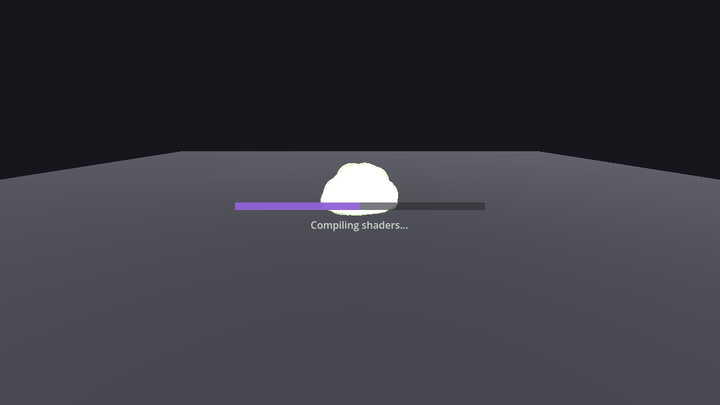

# VFX Preload Example (Godot 4.7+)

Eliminates the hitch when a VFX appears for the first time.

**The problem**: instantiating a PackedScene at runtime does **not** compile GPU render
pipelines. The first time a shader/material combination is actually drawn, the driver
compiles SPIR-V to hardware shaders — that's the multi-hundred-ms stutter players see
on the first explosion.

**The fix**: two-phase preloading. Phase 1 caches resources off-thread. Phase 2
instantiates every scene inside a hidden 64x64 SubViewport and renders it for exactly
one frame — that single render is what triggers real GPU pipeline compilation.



## Quick start — standalone demo

1. Open this folder in Godot 4.7+ (it is a complete project).
2. Press F5.
3. Watch the progress bar run two phases (resource load, then shader compile).
4. Click anywhere to spawn particle bursts — no first-cast hitch.

## Drop into your own project

Copy `addons/vfx_preloader/` into your project, then:

```gdscript
var preloader := VFXPreloader.new()
preloader.scene_paths = VFXPreloader.collect_scene_paths("res://assets/vfx")
# ...or list paths manually:
# preloader.scene_paths = PackedStringArray(["res://assets/vfx/explosion.tscn"])

preloader.preloading_completed.connect(_start_game)  # gate your gameplay here
add_child(preloader)
preloader.preload_all()

func _start_game() -> void:
	preloader.queue_free()  # done — the preloader releases its warmup viewport itself
	# ... enter gameplay
```

Requires Godot 4.2+, tested on 4.7 (Forward+).

Optional UI hooks while it runs:

- `preloader.is_preloading() -> bool`
- `preloader.get_progress() -> float` (0.0 → 1.0)
- `preloader.get_phase_label() -> String` ("Loading resources..." / "Compiling shaders...")
- signals: `preloading_started`, `preloading_completed`

Best used behind a loading screen at startup — show the bar, wait for
`preloading_completed`, then enter gameplay.

## Proving it works — A/B hitch test

The demo ships with a deliberately heavy effect (`heavy_burst.tscn`): a 1024×1024
procedurally generated noise texture, a high-poly draw mesh (96×48 sphere), 1500
particles, and a 3×8-octave fbm shader. Its first use costs CPU texture generation +
GPU upload + shader pipeline compilation — guaranteed hitch if not preloaded.

`tests/run_ab_test.gd` runs the demo twice automatically. **It deletes Godot's on-disk
shader pipeline cache (`user://shader_cache`) before every run**, so each run starts
from cold and the test is repeatable.

> **This test measures real GPU pipeline compilation — run it windowed on real
> hardware.** A headless run uses Godot's dummy renderer (no GPU): it exercises
> the code paths only, and its numbers are not meaningful.

```bash
godot --headless --path . --script res://tests/run_ab_test.gd -- --mode=both
godot --headless --path . --script res://tests/run_ab_test.gd -- --mode=preload
godot --headless --path . --script res://tests/run_ab_test.gd -- --mode=nopreload
```

The orchestrator is pure GDScript and cross-platform: it re-launches the same Godot
binary it runs under (`OS.get_executable_path()`), so it works wherever your editor
binary works — no shell scripts, no hardcoded paths. Results are exchanged via a
file rather than stdout because Windows Godot is a GUI-subsystem process whose
output doesn't attach to the calling process.

It launches the game with `--auto-test` (spawns the heavy effect by itself, measures
frame time around the spawn, prints a `HITCHTEST RESULT` line, quits) and prints a
comparison. Reference output (RTX-class GPU, Godot 4.7, Forward+):

```
HITCHTEST RESULT: peak=18.9ms  baseline=5.55ms  ratio=3.4x   mode=preloaded
HITCHTEST RESULT: peak=138.6ms baseline=5.55ms  ratio=25.0x  mode=no-preload
```

The preloaded run's peak is one vsync frame — no perceptible hitch. The no-preload
run stutters for ~9 frames.

Manual modes (user args go after `--`):

```powershell
godot --path . -- --auto-test     # auto-spawn heavy effect, print measurement, quit
godot --path . -- --no-preload    # skip preloader; first click hitches visibly
godot --path .                    # default: preload, click to spawn
```

Why clearing `shader_cache` matters: Godot persists compiled pipelines to
`user://shader_cache` and reloads them on the next launch. Without wiping it, every
run after the first would look "preloaded" regardless of mode. (The OS graphics
driver keeps its own shader cache too — it softens compile cost slightly but does
not eliminate the measurement gap. In-process caches are irrelevant here because
each run is a fresh process.)

## How it works

| Phase | What happens | Why |
|---|---|---|
| 1 — Resource cache | `ResourceLoader.load_threaded_request()` per scene, N concurrent | Warms GLSL→SPIR-V compilation, caches textures/meshes off the main thread |
| 2 — Pipeline warmup | Batches of scenes instantiated into a hidden SubViewport (Camera3D + DirectionalLight3D included), rendered one frame via `UPDATE_ONCE`, previous batch freed next frame | A render pass is the only thing that triggers SPIR-V→hardware pipeline compilation. Camera+light are required for spatial shader variants |
| Settle | `compile_settle_frames` idle frames after the last batch | Lets async pipeline compilation drain before `preloading_completed` fires |

Reliability details:

- Warmup instances run with `PROCESS_MODE_DISABLED` — no particle simulation, pure draw warmup.
- Each batch stays alive until the *next* frame, so every scene is guaranteed at least one rendered frame.
- Phase 1 has a per-resource timeout; timed-out scenes are skipped in Phase 2 instead of stalling everything.

## vs Godot's built-in shader mechanisms

The Godot docs page this technique is based on —
[pipeline compilations](https://docs.godotengine.org/en/stable/tutorials/performance/pipeline_compilations.html)
— describes three mechanisms that all get called "built-in precompilation". None replaces this preloader; each covers a different slice:

| Mechanism | What it covers | What it misses |
|---|---|---|
| Export **shader baker** (4.5+) | Shader compilation only: GLSL → SPIR-V/DXIL/MIL, bundled into the PCK | Cannot do **pipeline compilation** (SPIR-V → hardware) — that step is driver/GPU-dependent and only runs on the player's machine. The docs state outright it is "not a replacement for pipeline precompilation" |
| **Ubershaders + automatic precompilation** (4.4+, Forward+/Mobile) | Pipelines for meshes/nodes present at load time; specialized variants compile in background | Scenes spawned **dynamically during gameplay** (spell impacts, hit effects) are invisible until first cast. No 2D/Canvas coverage. No API to gate gameplay on "pipelines ready". Node-level material overrides and late-enabled features (MSAA level, GI, ...) can slip through |
| **SubViewport warmup** (the docs' own workaround for dynamic effects) | What this preloader implements | — |

In other words: the baker runs on **your** dev machine; the expensive step happens on
the **player's** machine, at first draw. The baker ≈ this preloader's Phase 1 (done at
export, shader step only). Phase 2 — the actual GPU pipeline build — is the step no
export-time tool can do, and the docs' prescribed fix for dynamically spawned effects
is exactly *"instantiate the scene at least once, even off-screen... e.g. using a
SubViewport"*.

Where each stage lands:

| Stage | Naive | 4.4+ auto-precompile | Shader baker (4.5+) | **This preloader** |
|---|---|---|---|---|
| Resource cache (CPU) | first load | load time | load time | loading screen (threaded) |
| Pipeline compilation (the hitch) | first draw | background, load-time scenes only | **never** (skips SPIR-V step only) | **loading screen** |
| VRAM upload | first draw | first draw | first draw | **loading screen** |
| Effect `_ready()` / CPU setup | first draw | first draw | first draw | **loading screen** |
| Gated deterministically | — | no API | — | signal + progress |

What this preloader adds over using built-ins alone:

- Covers dynamically spawned VFX — instanced + rendered once during loading, before any gameplay click can trigger them
- Batches N scenes/frame so the loading screen stays responsive, with per-resource timeouts
- Deterministic gating: `preloading_completed` signal + progress — you control when gameplay starts
- Runs your effect scripts early (`_ready()` runs during warmup), so CPU-side first-use costs (procedural texture generation, material setup) land on the loading screen too
- Works on the Compatibility renderer (where 4.4+ ubershader machinery doesn't exist) and pre-4.4 engines
- Verifiable: pair with `tests/run_ab_test.gd` for a measured before/after

**When built-in alone is enough**: Godot 4.4+, Forward+/Mobile, and every VFX lives in a scene visible at load time. Watch the debugger's pipeline compilation monitors — if you see no **Surface**/**Draw** step spikes during gameplay, you don't need this. If effects spawn dynamically and you see spikes when they first appear, you do.

## Tuning

| Export | Default | Meaning |
|---|---|---|
| `max_concurrent_loads` | 4 | Phase 1 thread loads in flight |
| `warmup_batch_size` | 5 | Phase 2 scenes rendered per frame (raise for many small VFX) |
| `per_resource_timeout_ms` | 5000 | Phase 1 give-up time per scene |
| `compile_settle_frames` | 10 | Idle frames before completion signal |

## Known limitations

- **The cost lands on the player's machine, in your loading screen, by design.**
  Godot's 4.4+ background precompilation spreads the same work over gameplay using
  ubershaders. If your effects are all visible at load time and rare small stutters
  are acceptable, the native path avoids the loading-time trade entirely.
- Warmed resources stay in memory (RAM + VRAM) for the session — don't warm a
  library you won't spawn.
- Needs a natural loading point to gate on. Seamless/open-world games fit the
  native background approach better.
- The warmup light has shadows off, so **shadow-pass pipeline variants are not warmed**.
  If your world uses shadow-casting lights on VFX, first shadowed draw can still hitch.
- Pipelines are compiled per shader variant. A variant only produced by settings the
  warmup viewport doesn't use (e.g. MSAA, different render scaling) compiles on first
  real encounter. Keep the warmup render settings close to your game's.
- Warm only what you actually spawn: `.tscn` scenes containing the materials/meshes
  you use at runtime (VFX, projectiles, effects — not UI scenes).

## Files

```
addons/vfx_preloader/vfx_preloader.gd   # the addon — copy this folder
demo/demo.gd + demo.tscn                # showcase + A/B harness (--auto-test, --no-preload)
demo/vfx/                               # 3 light bursts + heavy_burst (hitch generator)
tests/run_ab_test.gd                    # repeatable A/B test, wipes shader cache per run
```

License: MIT — see [LICENSE](LICENSE).
